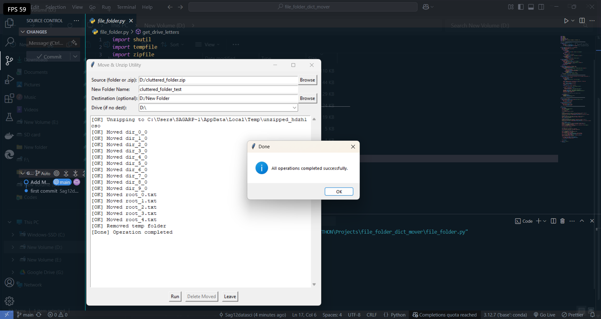

📂 Move & Unzip Utility

A simple Python GUI tool to help you quickly unpack ZIP archives (if needed) and move their contents—or any selected folder’s contents—into a new, neatly organized directory of your choosing.

---

✨ Features

- **Unzip If Needed**  
  Detects `.zip` sources and automatically extracts them to a temporary folder before moving.

- **Move Files & Folders**  
  Moves all files/subfolders from the selected source into a new target directory.

- **Custom Folder Name**  
  Specify exactly what you want the new folder to be called.

- **Flexible Destination**  
  — Pick any destination path  
  — Or fall back to selecting from available drive letters

- **Detailed Log**  
  Real-time log window showing success, warnings, and errors as files are moved.

- **Safe Cleanup**  
  Temporary extraction folders are removed when the operation completes.

- **Delete Moved Folder**  
  One-click delete of the newly created target folder if you change your mind.

---

## 🛠️ Prerequisites

- **Python 3.6+**  
- **Tkinter** (usually included with Python)  
- **psutil**  
  ```bash
  pip install psutil
````

*All other libraries (`shutil`, `tempfile`, `zipfile`, `pathlib`, `traceback`) are part of Python’s standard library.*

---

## 🚀 Installation & Setup

1. **Clone the repo**

   ```bash
   git clone https://github.com/your-username/move-unzip-utility.git
   cd move-unzip-utility
   ```

2. **Install dependencies**

   ```bash
   pip install psutil
   ```

3. **Run the application**

   ```bash
   python move_unzip_utility.py
   ```

---

## 📦 Usage

1. **Select Source**

   * Click **Browse** next to “Source” and choose either a folder or a `.zip` file.

2. **Enter New Folder Name**

   * Type in the name you want for the folder that will contain the moved items.

3. **(Optional) Choose Destination**

   * Provide a full path, or leave blank to use one of your drive letters.

4. **Run**

   * Click **Run**. Watch the log to see items being unzipped (if ZIP) and moved.

5. **Delete Moved Folder**

   * If you decide you don’t want the new folder, click **Delete Moved**.

6. **Leave**

   * Click **Leave** to close the app once you’re done.

---

## 🖼️ Screenshots

<details>
<summary>GUI Layout Preview</summary>



</details>

---

## ⚠️ Notes

* **Overwrite Protection**: Existing files with the same name will be overwritten by default.
* **Hidden Files**: All entries—including hidden files—are moved unless filtered out.
* **Permissions**: Ensure you have write permissions in the destination folder.

---

## 📄 License

This project is released under the MIT License. See [LICENSE](LICENSE) for details.

```
```
